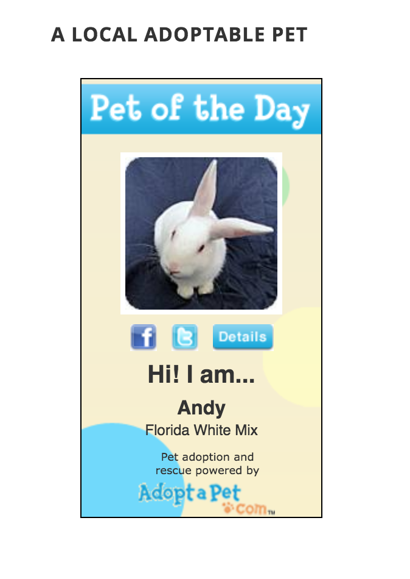
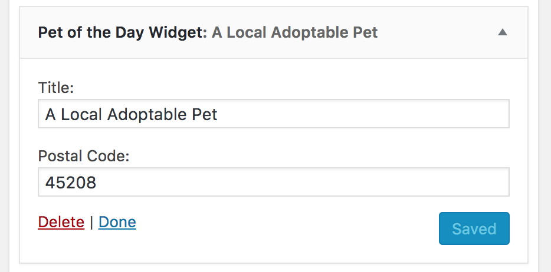

# Pet of the Day Widget

> Display an Adopt-a-Pet.com pet of the day for a US zip code in a widget.

    

## Description

This plugin creates a widget to display an adoptable "pet of the day" for a given US or Canadian postal code, powered by Adopt-a-Pet.com.

When a user clicks on the pet image or the details button, they'll be taken to that pet's profile on Adopt-a-Pet.com in a new browser window or tab.

Use this plugin to encourage local pet adoption and adoptable pet awareness on your WordPress site.

### Front end widget display

### Admin widget configuration

## Requirements

* [WordPress](http://wordpress.org) 3.0.1+

## Installation

Pet of the Day Widget is most easily installed automatically via the Plugins tab in your dashboard.

## Support Level

**Inactive:** I no longer actively maintain this project, and do not expect to provide any additional updates or features, including testing against newer versions of WordPress.  Bug reports, questions, and pull requests are welcome but may not be handled or responded to in a timely manner or at all.

## Contributing

Pull requests and issues on [GitHub](https://github.com/ChrisHardie/pet-of-the-day-widget) are welcome.